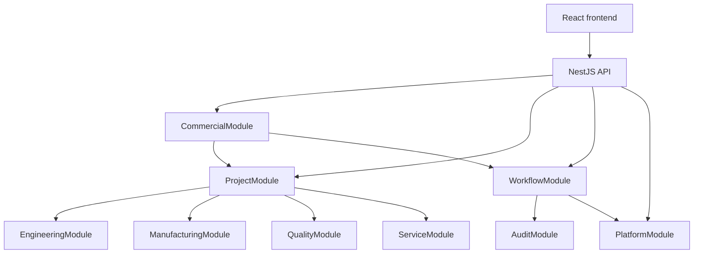

# System Architecture

## Purpose
This document captures the current MITRA v3.2.1 implementation architecture after the production certification work. It supersedes earlier architecture notes that described the commercial domain as a single monolithic service.

## Current architectural shape
MITRA is implemented as a modular NestJS monolith with a clear domain split around the project lifecycle:

- Commercial domain: customer, enquiry, RFQ, quotation, and acceptance workflows
- Project domain: projects, milestones, tasks, teams, and timeline data
- Workflow domain: state-machine-driven transitions and versioned execution state
- Platform and audit domains: authentication, RBAC, notifications, audit records
- Engineering, manufacturing, quality, service, and knowledge domains: downstream lifecycle modules

## Core layers

### Presentation
- React 18 + Vite frontend
- Route-based lazy loading for page-level chunks
- React Query for server state and Zustand for local state
- Memoized context providers for stable app state

### Application
- NestJS modular monolith with one domain module per bounded context
- Commercial module uses facade services and leaf services
- Workflow transitions are transactional and guarded by state-machine rules
- Optimistic locking protects concurrent workflow mutations with HTTP 409 conflicts

### Data
- PostgreSQL for transactional domain data
- Redis for caching and queue-like coordination
- MinIO for document and engineering-file storage
- Audit tables remain append-oriented and preserve history

## Domain decomposition in the current implementation

### Commercial domain
- CustomerService orchestrates customer creation and associated contact/address/note/activity data
- QuotationService orchestrates pricing, approval, revision, and acceptance flows
- Leaf services are responsible for single-responsibility sub-tasks and do not own the public orchestration API
- QuotationAcceptanceService breaks the old quotation/project coupling and creates the project from an accepted quotation

### Project management domain (Sprint 2.2)
- ProjectFactoryService is the single creation entry point: one transaction creates the project (`PRJ-{year}-{NNNN}`, `23505` retry), the DEFAULT_MOLD milestone template, default folders, and the workflow instance; events publish post-commit
- ProjectWorkflowService drives the lifecycle via the DB-seeded `project_management` workflow (DRAFT → … → ARCHIVED); generic PATCH routes never mutate `stage`/`status`
- Leaf services (Milestone, Task, Team, Risk, Document, Timeline, Activity, AI projection) enforce tenant isolation, dependency gating (DONE blocked by open dependencies), and business-event auditing
- AiProjectionService returns uniform `NOT_CONFIGURED | OK` envelopes so the frontend degrades gracefully without an AI provider

### Workflow domain
- WorkflowService owns workflow instances, transitions, history, and state validation
- Workflow instances use optimistic locking via a version column
- RFQ transitions are executed inside a single transaction that commits state, workflow version, audit, and notifications together

### Platform and audit layer
- Auth and RBAC are handled by platform services
- AuditService records business events and supports the transactional workflow contract
- NotificationService writes the notification row in the same transaction as the workflow state change

## Dependency rules now enforced
- No circular module dependency via forward references is used in the backend implementation
- Facade services orchestrate; leaf services depend on repositories and cross-cutting services only
- Workflow state changes are performed through explicit workflow methods rather than generic status updates

## Current architecture diagram

## Migration and data integrity
- Migration 0014 is part of the v3.2.1 release posture and hardens master-data key uniqueness and null-safe foreign-key behavior
- The current implementation expects partial uniqueness and `ON DELETE SET NULL` semantics for specific master-data relationships

## ADRs in effect
- ADR-001: Transactional workflow consistency
- ADR-002: Optimistic locking via version column
- ADR-003: Customer service decomposition
- ADR-004: Quotation service decomposition
- ADR-005: REST DELETE 204 policy
- ADR-006: Workflow transaction architecture
- ADR-007: Commercial module final architecture
- ADR-008: Migration 0014 data integrity remediation
- ADR-009: Project management domain
