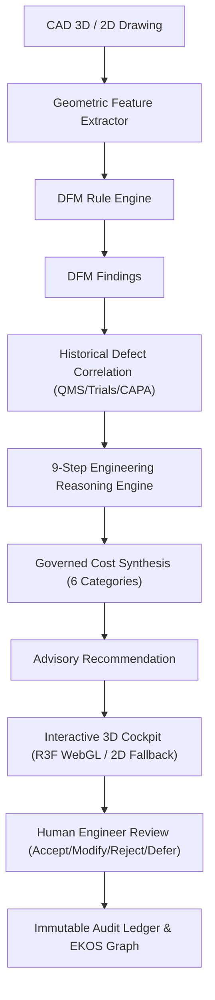

# M11.6 Certification Architecture Document

## 1. Unified Architecture Overview
MITRA M11 Engineering Copilot 2.0 unifies geometric analysis, DFM rule execution, historical defect grounding, 9-step reasoning, governed cost synthesis, and interactive 3D WebGL cockpit visualization under a human-governed advisory framework.

## 2. Hard Architectural Boundary
- AI proposes recommendations; Human Engineer decides.
- Zero autonomous modification of CAD geometry, 2D drawings, BOMs, routings, machines, or schedules.
