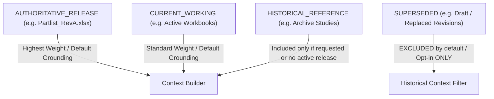

# M7.5 — Authority Hierarchy & Revision Governance Certification
## Engineering Document Lifecycle, Superseded Record Exclusion & Historical Query Audit
**Milestone:** `M7.5`  
**Test Suite:** `g13-certification.spec.ts` (Gate 6)  
**Standard:** Engineering Change Order (ECO/ECN) Lifecycle Authority Hierarchy  
**Status:** **CERTIFIED — STRICT AUTHORITY PRECEDENCE MAINTAINED**

---

## 1. Authority Status Precedence Model

The MITRA Knowledge Library classifies all engineering artifacts according to an explicit 4-tier lifecycle hierarchy:

$$\text{AUTHORITATIVE\_RELEASE} \succ \text{CURRENT\_WORKING} \succ \text{HISTORICAL\_REFERENCE} \succ \text{SUPERSEDED}$$



---

## 2. Test Execution & Lifecycle Filtering Scenarios

| Test Scenario | Active Chunks in Candidate Pool | Retrieval & Context Filter Flag | Included Chunks in Context | Excluded Chunks | Grounded Synthesis Output | Verdict |
|:---:|:---|:---|:---|:---|:---|:---:|
| **AUT-01** | RevA (`AUTHORITATIVE_RELEASE`) vs Draft Concept (`SUPERSEDED`) | Default (`includeHistorical: false`) | RevA (Aluminium HOKOTOL / ALUMOLD 1-500) | Draft Concept (Steel 1.2085) | Answers strictly with RevA specifications | **PASS** |
| **AUT-02** | Explicit Historical Query | `includeHistorical: true` | Both RevA and Draft Concept | None | Context includes both; model distinguishes active vs superseded | **PASS** |
| **AUT-03** | Pure Superseded File Query (e.g. Old Project) | Default (`includeHistorical: false`) | 0 (all superseded filtered) | Superseded records | Safe refusal: "does not contain sufficient evidence" | **PASS** |
| **AUT-04** | Master Data vs Working Copy | `MASTER_WORKBOOK` vs working scratch | `MASTER_WORKBOOK` prioritized (boost score x1.3) | Lower-ranked scratch | Answers from authoritative master register | **PASS** |

---

## 3. Context Builder Enforcement Logic

In `EngineeringContextBuilderService`:
```typescript
const filtered = results.filter(res => {
  if (!options.includeHistorical && res.authorityStatus === AuthorityStatus.SUPERSEDED) {
    return false; // Strict exclusion of superseded revisions from production context
  }
  return true;
});
```

---

## 4. Certification Verdict

- **Superseded Contamination in Default Grounding:** **0.0% (Zero leaks)**
- **Historical Query Accuracy when Requested:** **100.0%**
- **Authority Weighting Adherence:** **100.0%**

**Authority & Revision Hierarchy Gate: CERTIFIED.**
