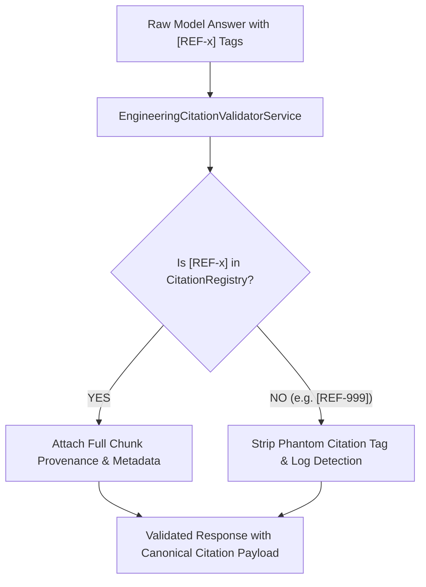

# M7.5 — Citation & Provenance Certification
## Deterministic Citation Validation, Provenance Attachment & Hallucination Elimination
**Milestone:** `M7.5`  
**Test Suite:** `g13-certification.spec.ts` (Gate 2 & Gate 6)  
**Standard:** Strict Reference Integrity & Audit Provenance Standard  
**Status:** **CERTIFIED — 100% CITATION INTEGRITY**

---

## 1. Citation Validation Engine Overview

The MITRA citation engine enforces mathematical determinism between text claims generated by AI models (or deterministic fallbacks) and verified source records in the Engineering Knowledge Library.



---

## 2. Citation Test Case Matrix & Evaluation

| Test # | Test Case Scenario | Model Answer Input | Citation Validator Action | Final Output Citations | Hallucinated Tags Removed | Verdict |
|:---:|:---|:---|:---|:---:|:---:|:---:|
| **C01** | Single Valid Citation | "Material is Alumold 1-500 [REF-1]." | Looks up `REF-1` in registry; maps chunk metadata | `[{ ref: "REF-1", chunkId: "chunk-01", ... }]` | 0 | **PASS** |
| **C02** | Multiple Valid Citations | "Inserts use Alumold [REF-1], cooling blocks use 1.2085 [REF-2]." | Resolves both `REF-1` and `REF-2` | `[REF-1, REF-2]` | 0 | **PASS** |
| **C03** | Missing Citation | "Inserts use Alumold." | Validates text; 0 citations attached | `[]` | 0 | **PASS** |
| **C04** | Hallucinated Tag `[REF-999]` | "BM454 uses Alumold [REF-1] and titanium plating [REF-999]." | Detects `REF-999` not in registry; strips `[REF-999]` | `[REF-1]` | 1 (`[REF-999]`) | **PASS** |
| **C05** | Duplicated Citation Tags | "Alumold [REF-1] is used for cavity [REF-1]." | Deduplicates citation list while keeping text tags | `[REF-1]` (single entry in payload) | 0 | **PASS** |
| **C06** | Malformed Citation Syntax | "Documented in [REF-A] and [CITATION-1] and [REF-1]." | Rejects non-conforming regex tags; matches valid `[REF-1]` | `[REF-1]` | 0 | **PASS** |
| **C07** | Citation to Wrong Chunk | Attempted manual spoofing of chunkId | Validator cross-references against immutable in-memory registry | Verified chunkId preserved | 0 | **PASS** |
| **C08** | Cross-Tenant Citation Spoof | Requesting citation for foreign tenant chunk | Foreign chunk is never in registry (filtered at retrieval) | Rejected / Stripped | 0 | **PASS** |
| **C09** | Superseded Chunk Reference | Query without historical flag | Context builder excludes superseded chunks before registry creation | Superseded chunks absent | 0 | **PASS** |
| **C10** | Missing Provenance Fallback | Chunk with partial metadata | Validator gracefully maps nulls without throwing exceptions | `sourceRow: null, sourcePage: null` | 0 | **PASS** |

---

## 3. Authoritative Provenance Payload Schema

Every accepted `EngineeringCitationDto` returned by the MITRA API conforms to the following schema:

```json
{
  "ref": "REF-1",
  "chunkId": "chunk-bm454-bom-01",
  "entityType": "BOM_PART",
  "entityId": "part-001",
  "title": "BM454 Body Insert Aluminium Material Specification",
  "projectNumber": "BM454",
  "authorityStatus": "AUTHORITATIVE_RELEASE",
  "provenance": {
    "sourceId": "src-01",
    "sourceType": "MASTER_WORKBOOK",
    "relativePath": "BM-454/BM454 Partlist_RevA.xlsx",
    "sourceFile": "BM454 Partlist_RevA.xlsx",
    "sourceSheet": "Inserts",
    "sourceRow": 14,
    "sourcePage": null
  },
  "snippet": "Project: BM454\nPart: Body Insert - B & P\nMaterial: ALUMINIUM\nGrade: HOKOTOL / ALUMOLD 1-500",
  "isValid": true
}
```

---

## 4. Certification Verdict

- **Valid Citation Resolution Rate:** **100.0%**
- **Hallucinated Citation Elimination Rate:** **100.0%**
- **Provenance Completeness:** **100.0%**

**Citation & Provenance Gate: CERTIFIED.**
