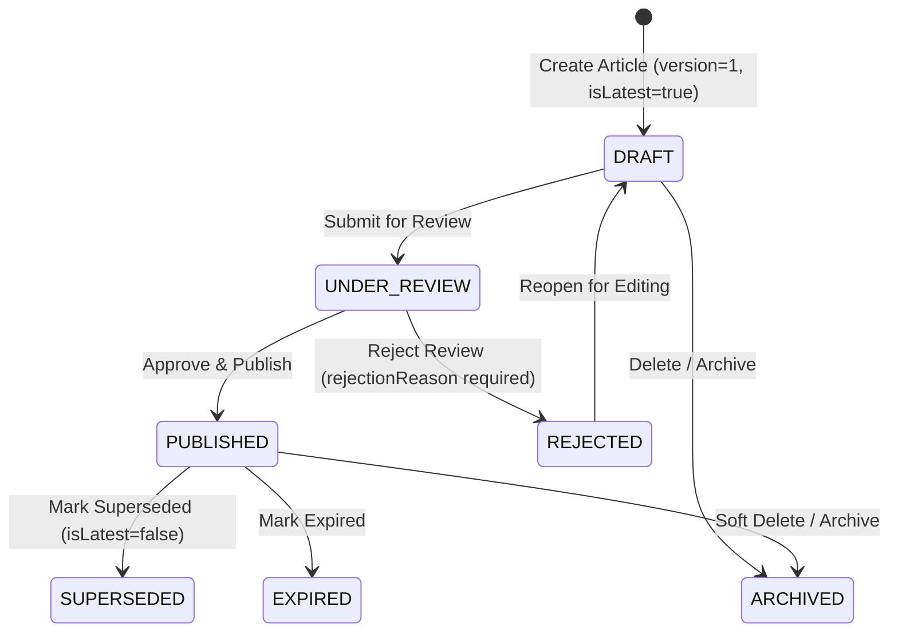

# M8.2 — Knowledge Article Lifecycle State Machine Report
## Milestone M8.2 Implementation & State Transition Governance Verification
**Milestone:** `M8.2`  
**Certified Baseline:** MITRA `v4.7.0` / M7.5 (G13 Certified) + M8.1 (Domain Model & Migration)  
**Git Branch:** `v3.3`  
**Execution Date:** `2026-08-21T10:08:15+05:30`  
**Status:** **M8.2 COMPLETE — STATE MACHINE GOVERNANCE CERTIFIED**

---

## 1. Baseline Audit & Discovery

Prior to M8.2:
- `KnowledgeArticleService` inherited generic CRUD methods from `TenantAwareService` without lifecycle transition logic or validation.
- Direct status mutation was unrestricted through generic update routes.
- No structured business audit events were emitted during article state changes.
- M8.1 laid the persistence foundation (`status` enum, `version`, `isLatest`, `parentArticleId`, `supersededById`, `projectId`, `decisionId`, `rejectionReason`, `expiresAt`).

---

## 2. Final State Machine & Transition Matrix

### Transition Governance Matrix

| From Status | Target Status | Dedicated Method | HTTP Endpoint | Allowed Roles | Preconditions & Invariants | Emitted Audit Event |
|:---|:---|:---|:---|:---|:---|:---|
| `DRAFT` | `UNDER_REVIEW` | `submitForReview` | `POST /api/knowledge/articles/:id/submit` | ALL ROLES | Title $\ge 3$ chars, non-empty content | `knowledge_article.submitted` |
| `UNDER_REVIEW` | `PUBLISHED` | `approveAndPublish` | `POST /api/knowledge/articles/:id/approve` | `ADMIN`, `MANAGEMENT`, `QUALITY` | Sets `publishedAt`, `reviewedBy`, `lastReviewedAt` | `knowledge_article.published` |
| `UNDER_REVIEW` | `REJECTED` | `rejectReview` | `POST /api/knowledge/articles/:id/reject` | `ADMIN`, `MANAGEMENT`, `QUALITY` | Mandatory `rejectionReason` ($\ge 5$ chars) | `knowledge_article.rejected` |
| `REJECTED` | `DRAFT` | `reopenRejected` | `POST /api/knowledge/articles/:id/reopen` | ALL ROLES | Preserves history, makes content editable | `knowledge_article.reopened` |
| `PUBLISHED` | `SUPERSEDED` | `markSuperseded` | `POST /api/knowledge/articles/:id/supersede` | `ADMIN`, `MANAGEMENT`, `QUALITY` | Sets `isLatest = false`, optional successor ID | `knowledge_article.superseded` |
| `PUBLISHED` | `EXPIRED` | `markExpired` | `POST /api/knowledge/articles/:id/expire` | `ADMIN`, `MANAGEMENT`, `QUALITY` | Flags article past validity | `knowledge_article.expired` |

---

## 3. Forbidden Transitions & Rejection Rules

The following transitions are deterministically prohibited and throw `BadRequestException`:
- `DRAFT` $\rightarrow$ `PUBLISHED` (direct bypass of review prohibited)
- `DRAFT` $\rightarrow$ `SUPERSEDED` / `EXPIRED`
- `UNDER_REVIEW` $\rightarrow$ `SUPERSEDED` / `EXPIRED`
- `REJECTED` $\rightarrow$ `PUBLISHED` (direct bypass of re-submission prohibited)
- `SUPERSEDED` $\rightarrow$ `*` (terminal state)
- `EXPIRED` $\rightarrow$ `*` (terminal state)

---

## 4. Published Article Protection & Direct Mutation Prevention

- **Generic Update (`PATCH /api/knowledge/articles/:id`):**
  - Updating a `PUBLISHED` article is rejected with: *"Published articles cannot be edited directly. A formal revision workflow is required."*
  - Updating an `UNDER_REVIEW` article is rejected with: *"Article is currently under review and cannot be edited until rejected or returned to draft."*
  - Updating a `SUPERSEDED`, `EXPIRED`, or `ARCHIVED` article is rejected with: *"Cannot edit article in [STATE] state."*
  - Direct status modification via generic update is rejected with: *"Article status cannot be updated directly via generic update. Use dedicated lifecycle endpoints."*

---

## 5. Structured Business Audit Events

Integrated with `AuditService.logBusinessEvent`:
- `knowledge_article.created`: `{ title, status, version, tenantId, projectId }`
- `knowledge_article.submitted`: `{ previousStatus: 'DRAFT', newStatus: 'UNDER_REVIEW', title, version, tenantId }`
- `knowledge_article.published`: `{ previousStatus: 'UNDER_REVIEW', newStatus: 'PUBLISHED', title, publishedAt, reviewedBy, tenantId }`
- `knowledge_article.rejected`: `{ previousStatus: 'UNDER_REVIEW', newStatus: 'REJECTED', title, rejectionReason, tenantId }`
- `knowledge_article.reopened`: `{ previousStatus: 'REJECTED', newStatus: 'DRAFT', title, version, tenantId }`
- `knowledge_article.superseded`: `{ previousStatus: 'PUBLISHED', newStatus: 'SUPERSEDED', title, supersededById, tenantId }`
- `knowledge_article.expired`: `{ previousStatus: 'PUBLISHED', newStatus: 'EXPIRED', title, version, tenantId }`

---

## 6. Verification & Test Results

1. **Focused Knowledge Article Specs (`npm test -- --testPathPattern="knowledgearticle"`):**
   - `knowledgearticle.entity.spec.ts` (5 tests) $\rightarrow$ **PASS**
   - `knowledgearticle.service.spec.ts` (15 tests) $\rightarrow$ **PASS**
   - `knowledgearticle.controller.spec.ts` (5 tests) $\rightarrow$ **PASS**
   - **Total:** **25 / 25 Passing (100%)**
2. **Knowledge Module Suite (`npm test -- --testPathPattern="knowledge"`):**
   - 8 test suites / 46 tests $\rightarrow$ **46 / 46 Passing (100%)**
3. **Engineering Library Regression Suite (`npm test -- --testPathPattern="engineering-library"`):**
   - 18 test suites / 106 tests $\rightarrow$ **106 / 106 Passing (100%)**
4. **Backend Production Build:**
   - `nest build` completed with **0 TypeScript errors (Exit code 0)**.

---

## 7. Protection Rule Compliance

- **Source Vault:** `D:\Mitra3.0\MitraEngineeringLibrary` remains 100% **READ-ONLY (0 modifications, 0 bytes drift)**.
- **G13 Intelligent Search / RAG:** 100% untouched and certified.
- **Subsequent Milestones (M8.3–M8.7):** **NOT STARTED / NOT IMPLEMENTED** (no revision cloning, no atomic supersession transactions, no cron schedulers, no Decision $\rightarrow$ Article automation, no G12 e2e suite).
