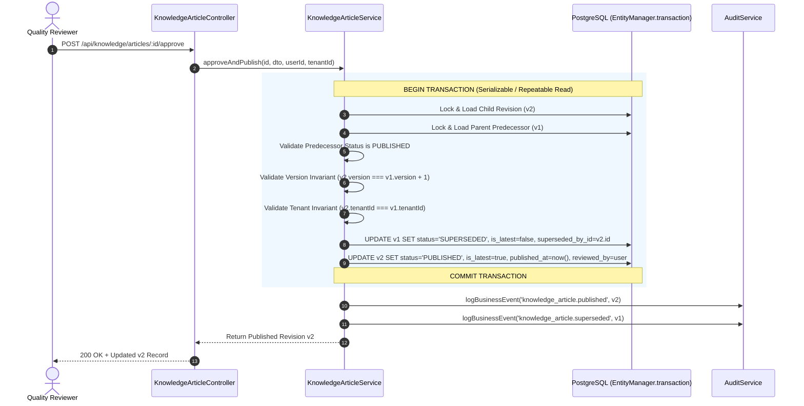

# M8.3 — Atomic Supersession & Transaction Specification
## ACID Guarantees, Transaction Isolation & Invariant Protection on Revision Publication
**Milestone:** `M8.3`  
**Execution Context:** `TypeORM EntityManager.transaction` / PostgreSQL 16  
**Status:** **SPECIFICATION COMPLETE**

---

## 1. Transaction Workflow

When a reviewer executes `POST /api/knowledge/articles/:id/approve` or `publish` on an article under review that has `parentArticleId`:

---

## 2. Invariants Guaranteed by Transaction Boundary

| Invariant | State on Success | State on Rollback |
|:---|:---|:---|
| **Parent Status** | `SUPERSEDED` | Remains `PUBLISHED` |
| **Parent isLatest** | `false` | Remains `true` |
| **Parent supersededById** | Set to `v2.id` | Remains `null` |
| **Child Status** | `PUBLISHED` | Remains `UNDER_REVIEW` |
| **Child isLatest** | `true` | Remains `false` |
| **Child publishedAt** | Timestamp recorded | Remains `null` |
| **Active Version Count** | Exactly 1 (`v2`) | Exactly 1 (`v1`) |
| **Audit Events** | Emitted post-commit | **Zero false events emitted** |

---

## 3. Rollback Failure Handling

If any exception occurs inside the transaction (e.g. database disconnect, lock timeout, constraint error, or unexpected validation failure):
1. TypeORM automatically triggers `ROLLBACK`.
2. Both rows revert to their pre-transaction states.
3. The method re-throws the error to the HTTP layer (yielding 4xx or 5xx).
4. No business audit events are written to `audit_logs`.
