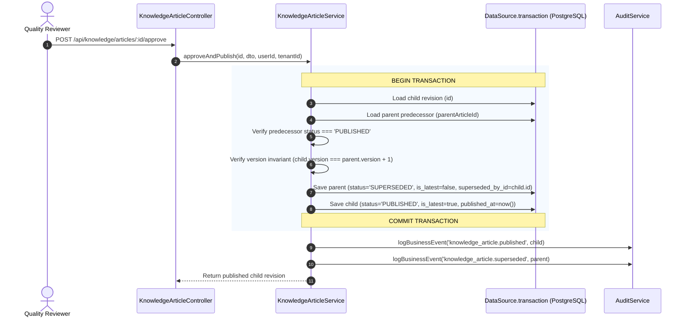

# M8.3 — Knowledge Article Revision Tracking & Atomic Supersession Report
## Milestone M8.3 Implementation, Transactional Supersession & Lineage Governance
**Milestone:** `M8.3`  
**Certified Baseline:** MITRA `v4.7.0` / M7.5 (G13 Certified) + M8.1 + M8.2  
**Git Branch:** `v3.3`  
**Execution Date:** `2026-08-21T10:18:40+05:30`  
**Status:** **M8.3 COMPLETE — REVISION & SUPERSESSION GOVERNANCE CERTIFIED**

---

## 1. Executive Summary & Baseline

Milestone **M8.3** implements the immutable revision tracking and atomic publication supersession architecture for `KnowledgeArticle`.

In accordance with strict quality and engineering change standards:
1. **Published Articles are Immutable:** Content and parameters in `PUBLISHED` articles cannot be edited in-place via `PATCH`.
2. **Dedicated Revision Authoring:** Engineers create draft revisions (`v2`, `v3`) via `POST /api/knowledge/articles/:id/revisions`.
3. **Atomic Multi-Row Supersession:** When a child revision is approved and published, the child transitions to `PUBLISHED` (`isLatest = true`) and the parent predecessor atomically transitions to `SUPERSEDED` (`isLatest = false`, `supersededById = child.id`) within a single ACID transaction (`DataSource.transaction`).
4. **Zero Split-Brain Lineage:** At all times, exactly one version per active article family is `PUBLISHED` and `is_latest = true`.

---

## 2. Schema Inspection & Migration Verdict

- **Database Migration:** **NONE REQUIRED** (`1700000000044-M8KnowledgeLifecycle.ts` delivered in M8.1 already established `version`, `is_latest`, `parent_article_id`, `superseded_by_id`, `project_id`, `decision_id`, `rejection_reason`, and `expires_at` with composite tenant indexes).
- **Physical Invariants Enforced in PostgreSQL:**
  - Foreign key constraints: `FK_knowledge_articles_parent`, `FK_knowledge_articles_superseded_by`.
  - Indexes: `IDX_knowledge_articles_tnt_status`, `IDX_knowledge_articles_tnt_is_latest`, `IDX_knowledge_articles_parent`, `IDX_knowledge_articles_superseded_by`.

---

## 3. Revision Model & Field Copying Semantics

When `createRevision(articleId, tenantId, userId)` is executed:
- Source article `v1` must have `status = 'PUBLISHED'`. (Attempts to revise `DRAFT`, `UNDER_REVIEW`, `REJECTED`, `SUPERSEDED`, `EXPIRED`, or `ARCHIVED` are rejected with `BadRequestException`).
- A new article entity is created with:
  - `version = source.version + 1`
  - `parentArticleId = source.id`
  - `isLatest = false`
  - `status = DRAFT`
  - `slug = generateUniqueSlug(source.title, tenantId, nextVersion)` (e.g. `cnc-roughing-v2`)
  - Cloned content: `title`, `content`, `summary`, `tags`, `categoryId`, `articleType`, `projectId`, `decisionId`, `relatedModules`, `accessRoles`, `seoKeywords`.
  - Reset fields: `publishedAt = null`, `reviewedBy = null`, `rejectionReason = null`, `supersededById = null`.
- Emits audit event: `knowledge_article.revision_created`.

---

## 4. Atomic Supersession Transaction Flow

---

## 5. Concurrency Strategy & Competing Revision Rejection

- **Stale Revisions Guard:** If two draft revisions `v2a` and `v2b` originate from `v1`, and `v2a` is published first:
  - When `v2b` attempts publication, the service inspects `v1`.
  - Detecting `v1.status === SUPERSEDED`, the transaction aborts with:  
    `BadRequestException('Predecessor article [v1] is already SUPERSEDED by [v2a]. Revision must be re-based on the latest published article.')`
- **Rollback Safety:** If a transaction failure occurs at any point, both records remain unchanged, and zero false audit events are logged.

---

## 6. Endpoints Implemented

| Method | Route | Description | Roles Allowed |
|:---|:---|:---|:---|
| `POST` | `/api/knowledge/articles/:id/revisions` | Create child draft revision (`vN+1`) from published article | `ADMIN`, `MANAGEMENT`, `SALES`, `DESIGN`, `PLANNING`, `PRODUCTION`, `QUALITY` |
| `GET` | `/api/knowledge/articles/:id/revisions` | Retrieve ordered revision history lineage (`v1` $\rightarrow$ `v2` $\rightarrow$ `v3`) | ALL AUTHENTICATED |
| `POST` | `/api/knowledge/articles/:id/approve` | Approve & publish revision (atomically supersedes predecessor) | `ADMIN`, `MANAGEMENT`, `QUALITY` |
| `POST` | `/api/knowledge/articles/:id/publish` | Alias for approval & atomic publication | `ADMIN`, `MANAGEMENT`, `QUALITY` |

---

## 7. Verification & Test Results

1. **Focused Knowledge Article Spec Suite (`knowledgearticle.*.spec.ts`):**
   - `knowledgearticle.entity.spec.ts` (5 tests) $\rightarrow$ **PASS**
   - `knowledgearticle.controller.spec.ts` (6 tests) $\rightarrow$ **PASS**
   - `knowledgearticle.service.spec.ts` (20 tests) $\rightarrow$ **PASS**
   - **Total:** **31 / 31 Passing (100%)**
2. **Knowledge Module Suite (`npm test -- --testPathPattern="knowledge"`):**
   - 8 test suites / 52 tests $\rightarrow$ **52 / 52 Passing (100%)**
3. **Engineering Library Regression Suite (`npm test -- --testPathPattern="engineering-library"`):**
   - 18 test suites / 106 tests $\rightarrow$ **106 / 106 Passing (100%)**
4. **Backend Production Build:**
   - `nest build` completed with **0 TypeScript errors (Exit code 0)**.

---

## 8. Protection Rule Compliance

- **Source Vault:** `D:\Mitra3.0\MitraEngineeringLibrary` remains 100% **READ-ONLY (0 modifications, 0 bytes drift)**.
- **G13 Intelligent Search / RAG:** 100% untouched and certified.
- **Subsequent Milestones (M8.4–M8.7):** **NOT STARTED / NOT IMPLEMENTED** (no Decision $\rightarrow$ Article automation, no G13 chunk linkage, no search filtering, no G12 e2e suite).
