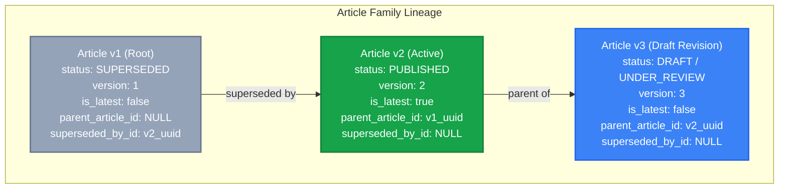

# M8.3 — Knowledge Article Revision Model Specification
## Immutable Published Baselines, Monotonic Versioning & Lineage Traceability
**Milestone:** `M8.3`  
**Target Entity:** `KnowledgeArticle` (`knowledge_articles`)  
**Status:** **SPECIFICATION COMPLETE**

---

## 1. Architectural Philosophy: Published Knowledge is Immutable

In industrial manufacturing and tooling environments governed by ISO 9001 and IATF 16949, standard operating procedures, troubleshooting guidelines, and technical parameters that have undergone formal sign-off must remain permanently verifiable.

**In-place mutation of a published article is forbidden.**  
Any changes to content, tolerances, or process guidelines require creating a child revision in `DRAFT`, subjecting it to review, and atomically superseding the prior version upon approval.

---

## 2. Conceptual Revision Hierarchy

---

## 3. Field Copying Semantics on `createRevision`

When `createRevision(articleId, tenantId, userId)` is called on a `PUBLISHED` article:

| Field | Source Article (v1) | Target Draft Revision (v2) | Handling Rule |
|:---|:---|:---|:---|
| `id` | `v1_uuid` | `v2_uuid` (New Generated UUID) | New identity for revision row |
| `title` | Copied | Copied (editable in draft) | Preserved |
| `slug` | `cnc-roughing` | `cnc-roughing-v2` | Deterministic unique revision slug |
| `content` | Copied | Copied (editable in draft) | Cloned as starting draft baseline |
| `summary` | Copied | Copied (editable in draft) | Preserved |
| `articleType` | Copied | Copied | Preserved |
| `categoryId` | Copied | Copied | Preserved |
| `tags` | Copied | Copied | Preserved |
| `relatedModules`| Copied | Copied | Preserved |
| `projectId` | Copied | Copied | Preserved |
| `decisionId` | Copied | Copied | Preserved |
| `accessRoles` | Copied | Copied | Preserved |
| `seoKeywords` | Copied | Copied | Preserved |
| **`version`** | `1` | `2` (`source.version + 1`) | Incremented by exactly 1 |
| **`isLatest`** | `true` (remains true until v2 published) | `false` | Drafts are never latest |
| **`status`** | `PUBLISHED` (untouched) | `DRAFT` | Initial state for revision |
| **`parentArticleId`**| `null` | `v1_uuid` | Bidirectional lineage pointer |
| **`supersededById`** | `null` (remains null until v2 published) | `null` | Set only on atomic publication |
| **`publishedAt`** | `2026-08-01` | `null` | Cleared until approved |
| **`reviewedBy`** | `user_qa_1` | `null` | Cleared until approved |
| **`rejectionReason`**| `null` | `null` | Cleared |
| `authorId` | `user_1` | `actor.id` | Set to author of revision |
| `tenantId` | `tenant_1` | `tenant_1` | Mandatory tenant matching |

---

## 4. Rejection of Invalid Revision Requests

`createRevision` throws `BadRequestException` if attempted on:
- `DRAFT`: Must finish authoring and review of current draft.
- `UNDER_REVIEW`: Currently awaiting reviewer decision.
- `REJECTED`: Must reopen to draft and resolve feedback.
- `SUPERSEDED`: Revision must be created from the currently active `PUBLISHED` version.
- `EXPIRED`: Expired articles must be recertified or revived through approved administrative workflows.
- `ARCHIVED`: Decommissioned content cannot be revised.
