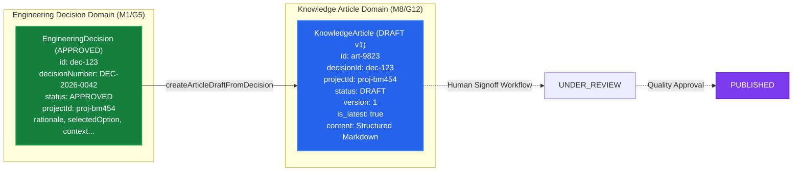

# M8.4 — Decision-to-Article Integration Specification
## Architecture Boundary, Approved Decision Eligibility & Provenance Linkage
**Milestone:** `M8.4`  
**Modules:** `engineering-decisions` $\leftrightarrow$ `knowledge`  
**Status:** **SPECIFICATION COMPLETE**

---

## 1. Architectural Relationship & Separation of Concerns

---

## 2. Decision State Eligibility Matrix

| Decision Status | Can Generate KnowledgeArticle Draft? | Reason / Handling |
|:---|:---:|:---|
| **`APPROVED`** | **YES (ALLOWED)** | Formal engineering choice signed off by authorized personnel. |
| **`DRAFT`** | **NO (REJECTED)** | Unapproved decision proposals cannot generate institutional knowledge. |
| **`SUBMITTED`** | **NO (REJECTED)** | Must await formal review and approval. |
| **`REJECTED`** | **NO (REJECTED)** | Disapproved decisions must not be drafted as best practices. |
| **`SUPERSEDED`** | **NO (REJECTED)** | Obsolete decisions must not generate new root knowledge articles. |
| **`CANCELLED`** | **NO (REJECTED)** | Abandoned decisions are non-actionable. |

---

## 3. Integration Mechanism

- **Trigger:** Service operation `createArticleDraftFromDecision(decisionId, userId, tenantId)` exposed via REST endpoint `POST /api/knowledge/articles/from-decision/:decisionId`.
- **Role Permissions:** `ADMIN`, `MANAGEMENT`, `DESIGN`, `PLANNING`, `PRODUCTION`, `QUALITY`.
- **Provenance Linkage:**
  - `KnowledgeArticle.decisionId` $\rightarrow$ `EngineeringDecision.id`
  - `KnowledgeArticle.projectId` $\rightarrow$ `EngineeringDecision.projectId`
  - `KnowledgeArticle.tenantId` $\rightarrow$ `EngineeringDecision.tenantId`
