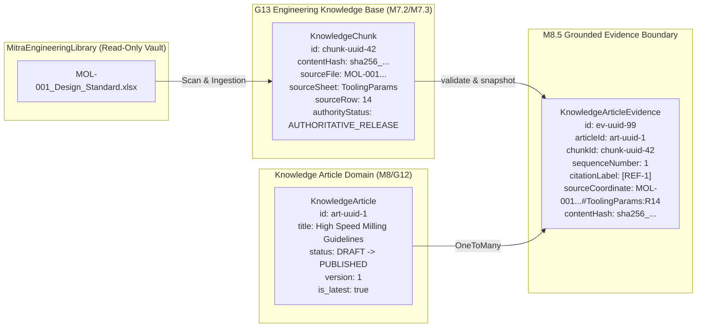

# M8.5 — Grounded Evidence Data Model Specification
## Physical Schema, Authoritative G13 Chunk Identity & Provenance Mapping
**Milestone:** `M8.5`  
**Target Entity:** `KnowledgeArticleEvidence` (`knowledge_article_evidence`)  
**Status:** **SPECIFICATION COMPLETE**

---

## 1. Authoritative Evidence Lineage Architecture

---

## 2. Entity Schema: `KnowledgeArticleEvidence`

| Column | Type | Nullable | Description / Invariant |
|:---|:---|:---:|:---|
| `id` | `UUID` | No | Primary Key (`IndustrialBaseEntity`) |
| `tenant_id` | `UUID` | No | Tenant ownership scope (must match `article.tenantId` & `chunk.tenantId`) |
| `article_id` | `UUID` | No | Foreign Key $\rightarrow$ `knowledge_articles(id)` (ON DELETE CASCADE) |
| `chunk_id` | `UUID` | No | Foreign Key $\rightarrow$ `knowledge_chunks(id)` (ON DELETE CASCADE) |
| `sequence_number` | `INTEGER` | No | Deterministic 1-indexed citation sequence order (1, 2, 3...) |
| `citation_label` | `VARCHAR(30)` | No | Computed label (e.g. `[REF-1]`, `[REF-2]`) |
| `source_file` | `VARCHAR(300)` | Yes | Snapshot of originating file path / workbook |
| `source_sheet` | `VARCHAR(100)` | Yes | Originating worksheet name (for tabular data) |
| `source_row` | `INTEGER` | Yes | Originating row index |
| `source_page` | `INTEGER` | Yes | Originating page number (for PDF / document specs) |
| `source_coordinate`| `VARCHAR(200)` | Yes | Human-readable coordinate (e.g. `MOL-001.xlsx#Params:R14` or `page:4`) |
| `authority_status` | `VARCHAR(50)` | Yes | Authority status at snapshot time (e.g. `AUTHORITATIVE_RELEASE`) |
| `entity_type` | `VARCHAR(50)` | Yes | Engineering domain category (e.g. `WORKBOOK_ROW`, `DOCUMENT_PAGE`) |
| `project_number` | `VARCHAR(50)` | Yes | Originating project code if applicable |
| `content_hash` | `VARCHAR(64)` | Yes | SHA-256 integrity hash of originating chunk text |
| `created_at` | `TIMESTAMPTZ` | No | Creation timestamp |
| `updated_at` | `TIMESTAMPTZ` | No | Modification timestamp |
| `deleted_at` | `TIMESTAMPTZ` | Yes | Soft deletion timestamp |

---

## 3. Physical Indexes & Uniqueness Invariants

1. `UNIQUE("tenant_id", "article_id", "chunk_id", "deleted_at")`: Prevents attaching the same physical chunk more than once to an article.
2. `INDEX("tenant_id", "article_id", "deleted_at")`: Rapid lookup of all evidence links for an article.
3. `INDEX("tenant_id", "chunk_id", "deleted_at")`: Reverse lookup of all articles relying on a specific G13 chunk.
