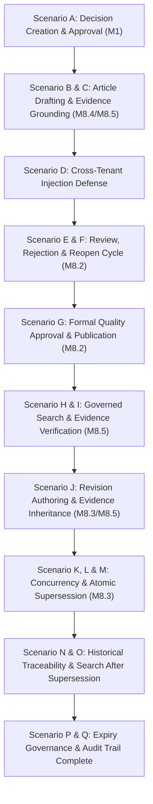

# M8.6 — G12 Golden Scenario Specification
## Complete End-to-End Decision-to-Supersession Knowledge Lifecycle
**Milestone:** `M8.6`  
**Status:** **SPECIFICATION COMPLETE**

---

## 1. Scenario Flow Breakdown

---

## 2. Detailed Scenario Catalog

| ID | Name | Core Operation | Expected Verification Gate |
|:---|:---|:---|:---|
| **A** | Decision $\rightarrow$ Knowledge | `POST /from-decision/:id` | DRAFT v1 created with `decisionId` & `projectId` preserved |
| **B** | Evidence Grounding | `POST /:id/evidence` | Valid G13 chunks attached; `[REF-1]`, `[REF-2]` generated |
| **C** | Deduplication | Re-attach chunk | Idempotent skip; no duplicate evidence or broken sequence |
| **D** | Cross-Tenant Attack | Tenant A article + Tenant B chunk | Rejected with 400/404; zero records inserted |
| **E** | Draft $\rightarrow$ Review | `POST /:id/submit` | Status `UNDER_REVIEW`; evidence locked from modification |
| **F** | Rejection & Reopen | `POST /:id/reject` $\rightarrow$ `POST /:id/reopen` | Rejection reason logged; reopen restores editable DRAFT |
| **G** | Publication | `POST /:id/approve` | Status `PUBLISHED`, `isLatest = true`, publishedAt set |
| **H** | Governed Search | `POST /knowledge/search` | Published article returned; unapproved/draft excluded |
| **I** | Search Filters | Filter `projectId`, `decisionId` | Exact match filtering verified |
| **J** | Revision & Cloning | `POST /:id/revisions` | Draft v2 created; baseline evidence inherited from v1 |
| **K** | Atomic Supersession | `POST /:id/approve` (v2) | v2 `PUBLISHED`, v1 atomically `SUPERSEDED` (`isLatest = false`) |
| **L** | Rollback Protection | Injected Tx Error | Transaction aborted; zero partial lineage or false audit |
| **M** | Competing Revision | Concurrent v2a & v2b | One succeeds; second fails stale predecessor guard |
| **N** | Traceability | `GET /:id/evidence` (v1) | v1 evidence intact and queryable |
| **O** | Search After Supersession | Search query | v2 returned; v1 excluded from default search |
| **P** | Expiry Governance | `POST /:id/expire` | `EXPIRED` status excluded from default search |
| **Q** | Audit Trail Complete | Audit log query | Structured events emitted post-commit for all operations |
