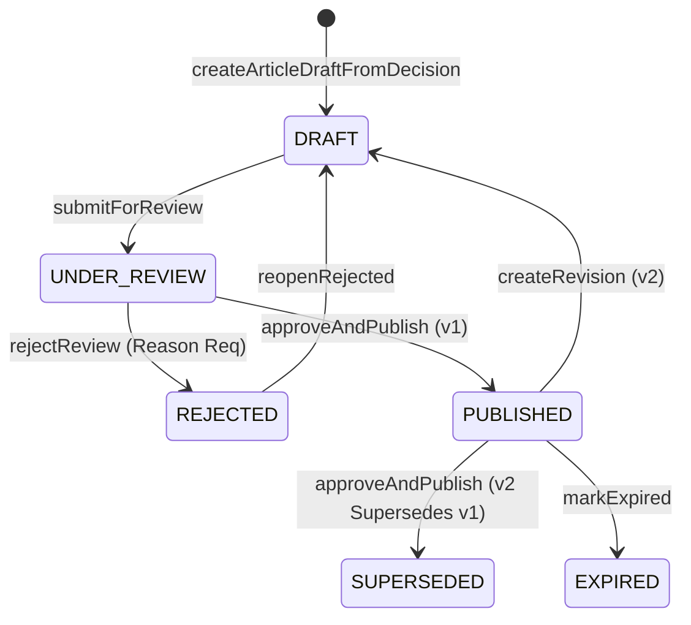

# M8.6 — Knowledge Article Lifecycle E2E Certification Report
## Complete Governance State Transitions, Review Gating & Supersession
**Milestone:** `M8.6`  
**Certified Target:** G12 Knowledge Lifecycle State Machine  
**Status:** **CERTIFIED**

---

## 1. Lifecycle Verification Matrix

---

## 2. Transition Gate Verification

| Transition | Action / Method | Authorization | Verified Invariant |
|:---|:---|:---|:---|
| `APPROVED Decision` $\rightarrow$ `DRAFT v1` | `createArticleDraftFromDecision` | Lead/Design | Idempotent root creation; `status = DRAFT`, `version = 1` |
| `DRAFT` $\rightarrow$ `UNDER_REVIEW` | `submitForReview` | Author | Content & evidence locked against in-place edits |
| `UNDER_REVIEW` $\rightarrow$ `REJECTED` | `rejectReview` | Quality/Reviewer | Mandatory reason recorded; evidence remains locked |
| `REJECTED` $\rightarrow$ `DRAFT` | `reopenRejected` | Author | Editability restored; content/evidence updates enabled |
| `UNDER_REVIEW` $\rightarrow$ `PUBLISHED` | `approveAndPublish` | Quality/Admin | `isLatest = true`, publishedAt set; in-place edits prohibited |
| `PUBLISHED v1` $\rightarrow$ `DRAFT v2` | `createRevision` | Author | New draft created; baseline evidence inherited; v1 unchanged |
| `PUBLISHED v1` $\rightarrow$ `SUPERSEDED` | `approveAndPublish` (v2) | Quality/Admin | Atomic multi-row transition inside single DB transaction |
| `PUBLISHED` $\rightarrow$ `EXPIRED` | `markExpired` | Quality/Admin | Status set to `EXPIRED`; excluded from default search |
