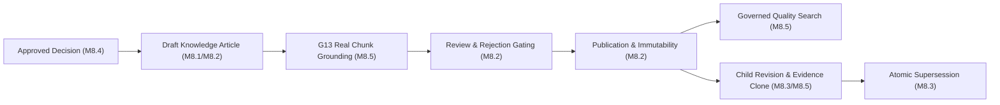

# M8.7 — Final G12 Certification Document
## Formal Closed-Loop Institutional Knowledge Governance Certification
**Milestone:** `M8.7`  
**Certified Predecessors:** MITRA `v4.7.0` (M7.5 G13 Certified) + M8.1 + M8.2 + M8.3 + M8.4 + M8.5 + M8.6  
**Classification:** **CERTIFIED**  
**Execution Timestamp:** `2026-08-21T12:18:58+05:30`

---

## 1. Executive Summary

Milestone **M8.7** establishes the formal, closed-loop certification and release readiness of the **G12 Institutional Knowledge Governance subsystem**.

The subsystem binds upstream Engineering Decisions to governed Knowledge Articles, anchors authoritative knowledge to physical G13 engineering retrieval chunks with deterministic citations, enforces institutional review/rejection/reopening lifecycles, and guarantees atomic supersession with monotonic versioning and single-latest search gating.

---

## 2. Certified Architecture Summary

---

## 3. Core Capabilities Certified

1. **Engineering Decision Formalization:** Idempotent generation of structured markdown drafts from approved decisions.
2. **G13 Evidence Grounding:** Deterministic citation generation (`[REF-1]`, `[REF-2]`) linked to verified physical `KnowledgeChunk` records under strict tenant isolation.
3. **Lifecycle State Machine:** Complete validation of `DRAFT` $\rightarrow$ `UNDER_REVIEW` $\rightarrow$ `REJECTED` $\rightarrow$ `DRAFT` $\rightarrow$ `PUBLISHED` with post-commit audit logging.
4. **Governed Search Quality Gate:** Default search strictly filters for `status = 'PUBLISHED' AND is_latest = true AND deleted_at IS NULL AND tenant_id = requestedTenant`, concealing all unapproved drafts and superseded revisions.
5. **Atomic Supersession & Immutability:** Child revisions inherit baseline evidence snapshots; publication atomically supersedes predecessors within a single ACID transaction without split-brain risk.
6. **Zero G13 / Vault Drift:** Physical library (`MitraEngineeringLibrary`) remains 100% read-only with 0 modifications and 0 bytes drift.
