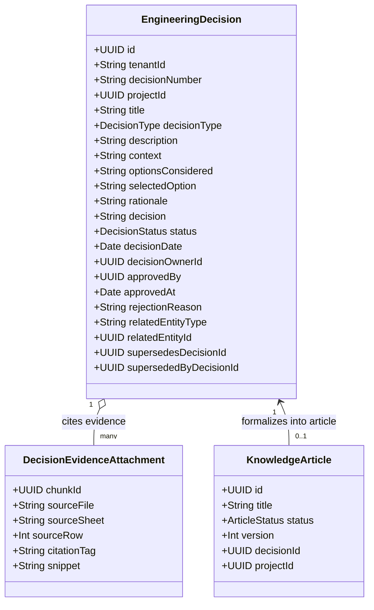

# M8 — Engineering Decision Corpus Specification
## Structured Decision Log Architecture, Evidence Attachment & Traceability Model
**Milestone:** `M8`  
**Target Module:** `engineering-decisions` & `knowledge`  
**Standard:** ISO 26262 / IEEE 1471 Architecture & Decision Rationale Capture  
**Status:** **SPECIFICATION FINALIZED**

---

## 1. Definition & Role of an Engineering Decision

In the MITRA operating system, an **Engineering Decision** is a permanent, immutable, auditable record that captures:
1. **WHAT** technical choice or modification was made (Decision Statement & Selected Option).
2. **WHY** it was chosen over competing options (Engineering Rationale & Alternatives Considered).
3. **WHAT EVIDENCE** justifies the choice (G13 Knowledge Chunks, Trial Test Logs, FEA Analysis, Tolerancing Calculations).
4. **WHO** made, approved, or rejected the decision (Owner, Quality Reviewer, Approver).
5. **WHEN** and for **WHICH PROJECT / ARTIFACT** (Project ID, Tool Number, Drawing Rev, BOM Revision).
6. **LIFECYCLE STATE** and **SUPERSEDING RELATIONSHIP** (Active, Superseded by DEC-xxxx).

---

## 2. Decision Data Model Architecture

---

## 3. Decision Types & Engineering Scope

| Decision Type | Primary Application | Required Evidence Type |
|:---|:---|:---|
| **`DESIGN`** | Core/cavity geometry, parting line layout, venting profile | CAD drawings, STEP analysis, G13 index specs |
| **`MATERIAL_SELECTION`** | Core steel (1.2085, 1.2316), aluminium insert grades | `EngineeringDataDictionary.md`, Partlist materials |
| **`PROCESS`** | CNC machining sequence, electrode extraction, polishing grade | Process planning sheets (`mekb.sqlite`), CAM logs |
| **`ENGINEERING_CHANGE`** | ECR disposition, design modification feasibility | ECR/ECO records, dimensional diffs |
| **`QUALITY`** | Tolerance concessions, deviation allowances | Inspection plans, CMM scan reports |
| **`TRIAL`** | Retrial parameter adjustments, venting enlargement | Trial T0/T1 reports, cycle time logs |
| **`COST / SCHEDULE`** | Workstation reassignment, toolmaker overtime approval | Capacity summaries, baseline variance engine |

---

## 4. Decision-to-Article Formalization Pipeline

When an `EngineeringDecision` transitions to `APPROVED`:
1. The decision service fires an event `engineering_decision.approved`.
2. The knowledge generator inspects the decision type.
3. For types `DESIGN`, `MATERIAL_SELECTION`, `PROCESS`, `QUALITY`, and `TRIAL`, an automated `KnowledgeArticle` draft is generated with:
   - `title`: `"[BEST PRACTICE / LESSON LEARNED] " + decision.title`
   - `summary`: `decision.rationale`
   - `content`: Formatted markdown detailing the Problem Context, Options Considered, Approved Choice, and Evidence Citations (`[REF-x]`).
   - `decisionId`: `decision.id`
   - `projectId`: `decision.projectId`
   - `status`: `DRAFT` (ready for technical writer / lead signoff).
