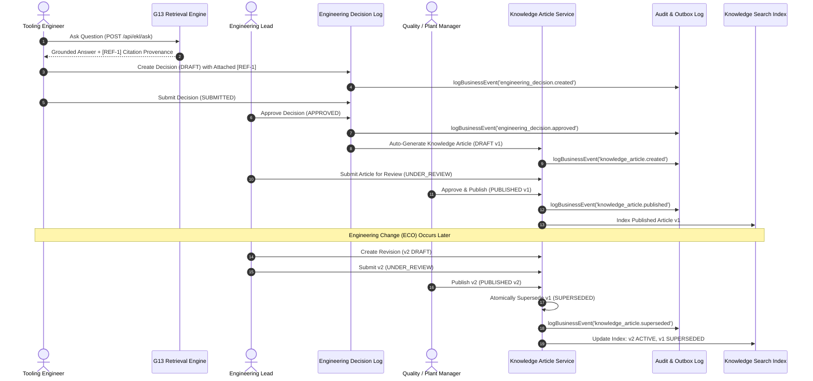

# M8 — G12 Full-Chain Traceability & Audit Model
## End-to-End Lineage: Technical Question → Grounded Evidence → Decision → Article → Revision → Supersession
**Milestone:** `M8`  
**Standard:** Digital Thread Provenance & ISO 9001 Auditability  
**Status:** **TRACEABILITY MODEL FINALIZED**

---

## 1. End-to-End Lifecycle Traceability Chain



---

## 2. Lineage Audit Data Contract

Every stage in the G12 digital thread attaches an immutable audit payload:

```json
{
  "traceId": "trace-g12-009841",
  "tenantId": "tenant-precision-molds",
  "hops": [
    {
      "hop": 1,
      "type": "EKL_GROUNDED_QUERY",
      "query": "BM454 Body insert aluminium grade",
      "citations": ["chunk-bm454-bom-01", "BM454 Partlist_RevA.xlsx"]
    },
    {
      "hop": 2,
      "type": "ENGINEERING_DECISION",
      "decisionNumber": "DEC-2026-0042",
      "status": "APPROVED",
      "author": "user-eng-lead-01",
      "approver": "user-plant-mgr-01"
    },
    {
      "hop": 3,
      "type": "KNOWLEDGE_ARTICLE",
      "articleId": "art-9823-v1",
      "title": "[BEST PRACTICE] BM454 Body Insert Aluminium Material Specification",
      "version": 1,
      "status": "SUPERSEDED",
      "supersededBy": "art-9823-v2"
    },
    {
      "hop": 4,
      "type": "KNOWLEDGE_ARTICLE_REVISION",
      "articleId": "art-9823-v2",
      "version": 2,
      "status": "PUBLISHED",
      "isLatest": true,
      "publishedAt": "2026-08-21T09:30:00Z"
    }
  ]
}
```

---

## 3. Compliance & Certification Rules

1. **Forward Traceability:** A user viewing a G13 raw workbook row can query which Decisions and Knowledge Articles cite it.
2. **Backward Traceability:** A user reading a published Knowledge Article can navigate back to the originating Decision Number, Project Number, and raw G13 chunk.
3. **Historical Auditability:** Querying an archived or superseded decision/article reconstructs the exact authoring state and reviewer signatures at the time of publication.
