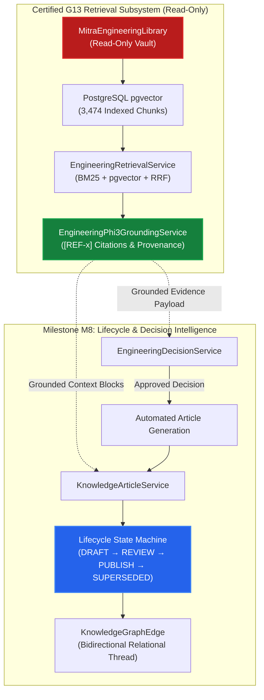

# M8 — G13 Integration Boundary & Architectural Compatibility Specification
## Connecting Certified G13 Knowledge Retrieval with M8 Decision & Lifecycle Intelligence
**Milestone:** `M8`  
**Certified Predecessor:** Milestone `M7.5` (G13 Certified)  
**Standard:** Clean Hexagonal Architecture & Read-Only Source Vault Invariants  
**Status:** **INTEGRATION BOUNDARY DEFINED & COMPATIBILITY VERIFIED**

---

## 1. Architectural Integration Topology

Milestone M8 connects the grounded retrieval intelligence of G13 directly into the authoring and validation workflows of **Knowledge Articles** and **Engineering Decisions**:

---

## 2. Protected Architectural Invariants

| Invariant | Protection Mechanism | Compatibility Guarantee |
|:---|:---|:---|
| **Source Vault Read-Only** | `MitraEngineeringLibrary` is never written to by M8 | Articles and decisions reside entirely in PostgreSQL `knowledge_articles` & `engineering_decisions`. |
| **Strict Multi-Tenancy** | `tenantId` parameter passed down to all G13 and M8 services | Articles created in Tenant A can only cite Tenant A evidence and are visible only to Tenant A. |
| **Authority Precedence** | G13 authority filter (`RELEASE` > `CURRENT` > `SUPERSEDED`) | Knowledge Articles mark superseded revisions as `SUPERSEDED`, removing them from active search by default. |
| **Deterministic Citations** | `EngineeringCitationValidatorService` validation contract | When an article is generated from an engineering decision, attached citations preserve `sourceFile`, `sourceSheet`, `sourceRow`. |
| **Audit & Outbox Integration** | `AuditService.logBusinessEvent` + `OutboxService` | All article state changes (`article.created`, `article.submitted`, `article.published`, `article.superseded`) emit structured audit rows. |
| **Local-First AI Operation** | Local Ollama `phi3:latest` integration | AI-assisted summarization and drafting use local Ollama without external network requests. |

---

## 3. Data Flow: From Technical Query to Authoritative Published Article

1. **Evidence Retrieval (G13):** Engineer queries G13 regarding a machining tolerance issue on project BM454 (`POST /api/ekl/ask`).
2. **Decision Recording (M8 / G5):** Engineering Lead records formal resolution in Decision Log (`POST /api/decisions`), attaching the G13 retrieval citation (`chunkId`, `sourceFile`).
3. **Decision Approval:** Quality / Engineering Manager approves decision (`POST /api/decisions/:id/approve`).
4. **Knowledge Article Generation (M8 / G12):** System drafts a `BEST_PRACTICE` / `TROUBLESHOOTING` article linking to `decision_id`, `project_id`, and `chunk_id`.
5. **Lifecycle Governance:** Article enters `UNDER_REVIEW`, passes sign-off, and is transitioned to `PUBLISHED` with immutable revision `v1`.
6. **Future Supersession:** When an ECO modifies the specification, a successor article `v2` is approved, atomically transitioning `v1` to `SUPERSEDED`.
