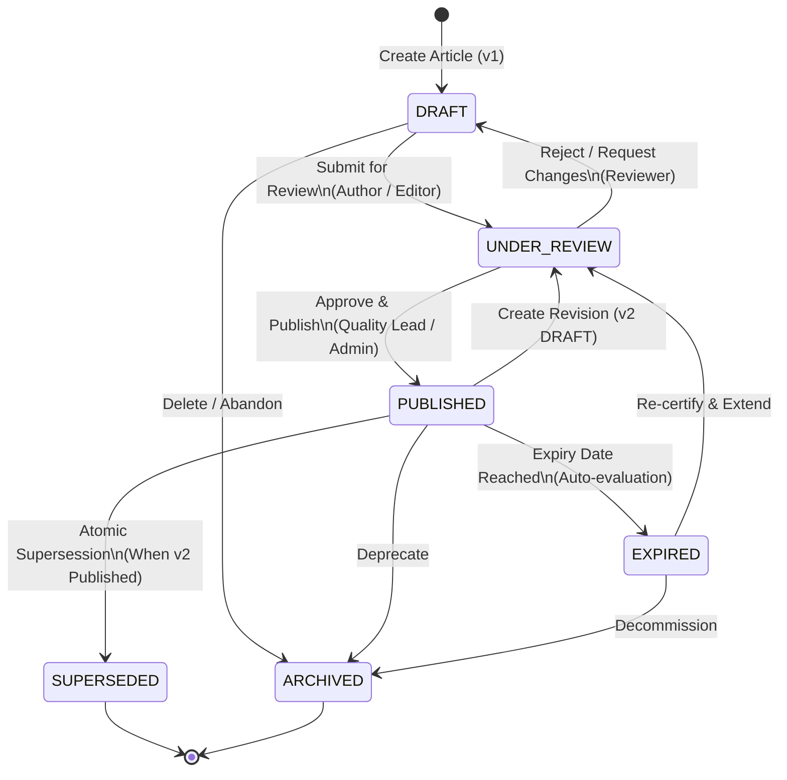

# M8 — Knowledge Article Lifecycle Specification
## Formal State Machine, Transition Rules, Revision Semantics & Supersession Governance
**Milestone:** `M8`  
**Target Entity:** `KnowledgeArticle` (`knowledge_articles`)  
**Standard:** ISO 9001 Document Control & Engineering Change Governance  
**Status:** **SPECIFICATION FINALIZED**

---

## 1. Article Lifecycle State Machine



---

## 2. Permitted Transition Matrix

| From State | To State | Action / Method | Required Role | Preconditions & Validation Rules | Audit Event Emitted |
|:---|:---|:---|:---|:---|:---|
| **DRAFT** | `UNDER_REVIEW` | `submitForReview(id)` | Author, Editor, Admin | Content non-empty, title $\ge 5$ chars, valid categoryId | `knowledge_article.submitted` |
| **DRAFT** | `ARCHIVED` | `archive(id)` | Author, Admin | Allowed from draft | `knowledge_article.archived` |
| **UNDER_REVIEW** | `DRAFT` | `rejectReview(id, reason)` | Reviewer, Lead, Admin | Rejection reason string required ($\ge 5$ chars) | `knowledge_article.rejected` |
| **UNDER_REVIEW** | `PUBLISHED` | `publish(id)` | Quality Lead, Lead, Admin | `reviewed_by` and `published_at` stamped; author $\ne$ reviewer (strict 4-eyes rule if configured) | `knowledge_article.published` |
| **PUBLISHED** | `UNDER_REVIEW` | `createRevision(id)` | Author, Editor, Admin | Clones v1 into v2 in `DRAFT`/`UNDER_REVIEW`; v1 remains active until v2 published | `knowledge_article.revision_created` |
| **PUBLISHED** | `SUPERSEDED` | `supersede(id, successorId)` | System / Transaction | Atomically executed when successor revision is published; sets `superseded_by_id` | `knowledge_article.superseded` |
| **PUBLISHED** | `EXPIRED` | `markExpired(id)` | System / Cron | Current timestamp $> \text{expires\_at}$ or $\text{review\_due\_date}$ | `knowledge_article.expired` |
| **PUBLISHED** | `ARCHIVED` | `archive(id)` | Admin, Management | Deprecates article permanently | `knowledge_article.archived` |

---

## 3. Detailed Operational Semantics

### A. Revision Semantics (v1 $\rightarrow$ v2)
- When a user calls `createRevision(articleId)`:
  1. A new `KnowledgeArticle` record is inserted with `parentArticleId = original.id`, `version = original.version + 1`, `isLatest = true`, and `status = DRAFT`.
  2. The original article retains `status = PUBLISHED` and `isLatest = false` until the successor is published.
  3. Readers querying by slug or search see the active published version without disruption during review of the draft revision.

### B. Supersession Semantics (Atomic Transaction)
- When the successor revision (v2) is approved:
  1. Successor status updates to `PUBLISHED`, `isLatest = true`, `publishedAt = now()`.
  2. Predecessor (v1) status updates to `SUPERSEDED`, `isLatest = false`, `supersededById = successor.id`.
  3. Predecessor and successor commit within a single database transaction (`EntityManager.transaction`).
  4. Knowledge graph edge `SUPERSEDES` is created linking successor $\rightarrow$ predecessor.

### C. Expiry Semantics
- An article can declare `reviewDueDate: Date` or `expiresAt: Date`.
- If expired, `isExpired` evaluates to true, status transitions to `EXPIRED`, and the search service demotes or filters it from standard active knowledge queries.

---

## 4. Entity Schema Additions (`KnowledgeArticle`)

```typescript
// Columns to be added to KnowledgeArticle entity in M8.1:
@Column({ name: 'version', type: 'int', default: 1 })
version: number;

@Column({ name: 'is_latest', type: 'boolean', default: true })
isLatest: boolean;

@Column({ name: 'parent_article_id', type: 'uuid', nullable: true })
parentArticleId: string | null;

@Column({ name: 'superseded_by_id', type: 'uuid', nullable: true })
supersededById: string | null;

@Column({ name: 'project_id', type: 'uuid', nullable: true })
projectId: string | null;

@Column({ name: 'decision_id', type: 'uuid', nullable: true })
decisionId: string | null;

@Column({ name: 'rejection_reason', type: 'text', nullable: true })
rejectionReason: string | null;

@Column({ name: 'expires_at', type: 'date', nullable: true })
expiresAt: Date | null;
```
