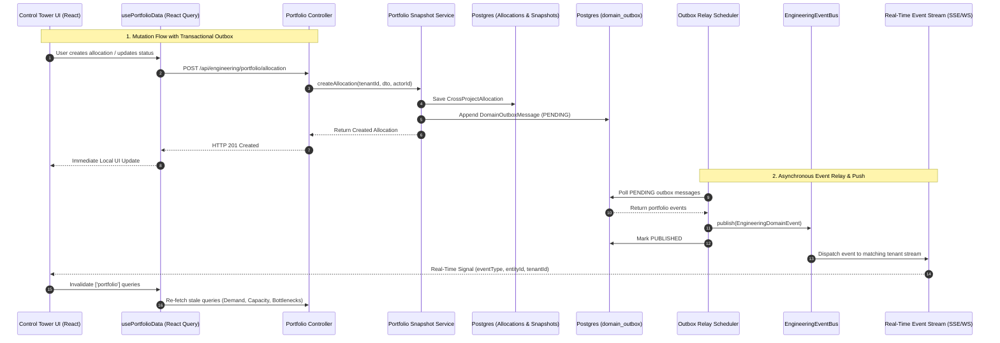

# MITRA M12.5 SPRINT 3 — ARCHITECTURE & COMPATIBILITY AUDIT

**MILESTONE:** MITRA M12.5 — Enterprise Engineering Orchestration  
**WORKSTREAM:** M12.5-P1 Sprint 3 — Real-Time Portfolio Intelligence  
**AUDIT ROLE:** Principal Software Architect  

---

## 1. Architectural Overview

MITRA's existing enterprise architecture leverages a clean separation between transactional persistence, asynchronous domain outbox processing, in-process event distribution, and client query caching. Sprint 3 builds upon these established components without introducing conflicting paradigms.

---

## 2. Component Assessment & Reuse Matrix

| Architectural Layer | Existing MITRA Pattern | Sprint 3 Implementation Plan | Compatibility Rating |
|---|---|---|---|
| **Transactional Outbox** | `OutboxService` (`src/modules/platform/services/outbox.service.ts`) | Reuse existing `append()` to write outbox rows alongside portfolio entity saves. | **100% Native** |
| **Outbox Storage** | `DomainOutboxMessage` (`domain_outbox` table) | Reuse existing `domain_outbox` schema. Zero migration needed. | **100% Native** |
| **Relay Scheduler** | `EngineeringOutboxRelayScheduler` (30s interval + on-demand) | Reuse existing scheduler and relay mechanisms. | **100% Native** |
| **In-Process Bus** | `EngineeringEventBus` (`events.EventEmitter`) | Extend subscriber registry to route events to the real-time stream. | **100% Native** |
| **Real-Time Gateway** | SSE (`@Sse`) / WebSocket with JWT Authentication | Expose `/api/engineering/portfolio/events` endpoint guarded by `JwtAuthGuard`. | **100% Native** |
| **Client Invalidation** | TanStack React Query v5 | Hook `usePortfolioRealtimeSync` listens to stream and invalidates `portfolioQueryKeys.all`. | **100% Native** |

---

## 3. Real-Time Stream Design: Server-Sent Events vs WebSocket

1. **Protocol Selection:**
   - For portfolio synchronization, the communication pattern is predominantly **Server-to-Client push of invalidation signals**.
   - Server-Sent Events (SSE) via NestJS `@Sse` provides native HTTP/2 multiplexing, standard JWT bearer header authorization, automatic reconnection, and zero additional runtime dependencies.
   - If bi-directional socket communication is required, standard NestJS WebSocket Gateway with JWT connection handshake can be utilized.
2. **Signal Pattern vs Data Payload:**
   - **Recommended Pattern:** The real-time stream delivers **signals** (metadata: `eventType`, `tenantId`, `entityId`, `timestamp`), NOT heavy domain models.
   - The frontend React Query cache handles authoritative data fetching upon signal receipt.
   - This eliminates out-of-order race conditions and preserves server-side query authorization.
