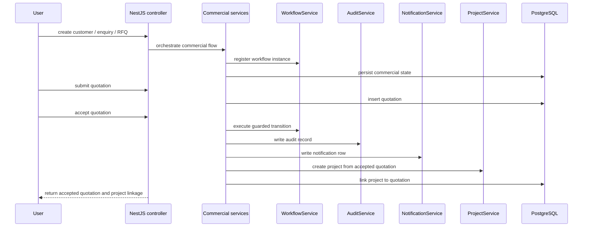
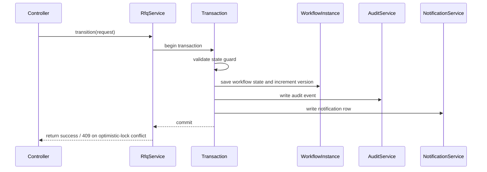
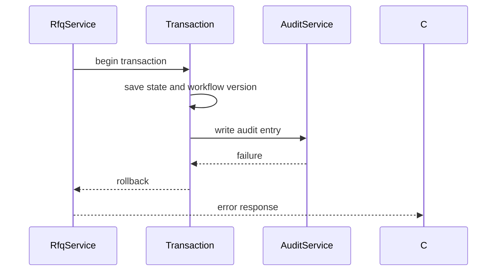
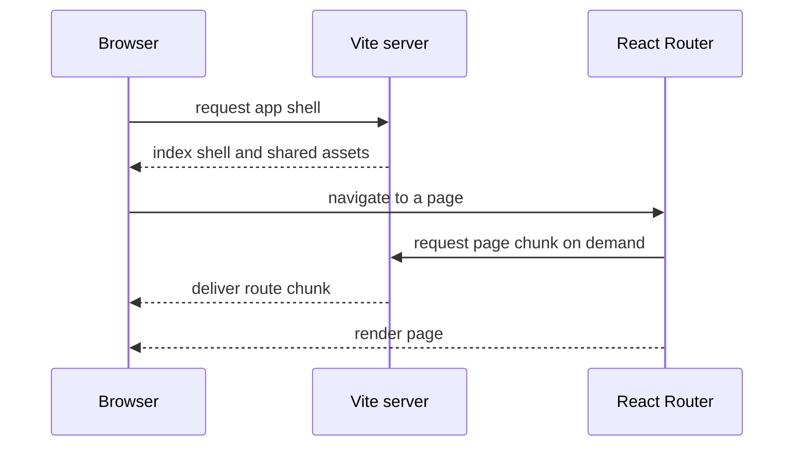
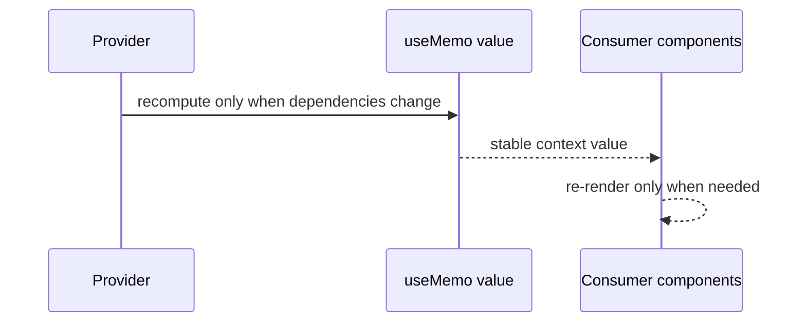

# Sequence Diagrams (v3.2.1)

The diagrams below reflect the runtime flows that are implemented in the current MITRA v3.2.1 backend and frontend code paths.

## 1. Quote-to-project lifecycle

## 2. Transactional workflow transition

## 3. Rollback on audit failure

## 4. Frontend route lazy loading

## 5. Frontend context memoization

