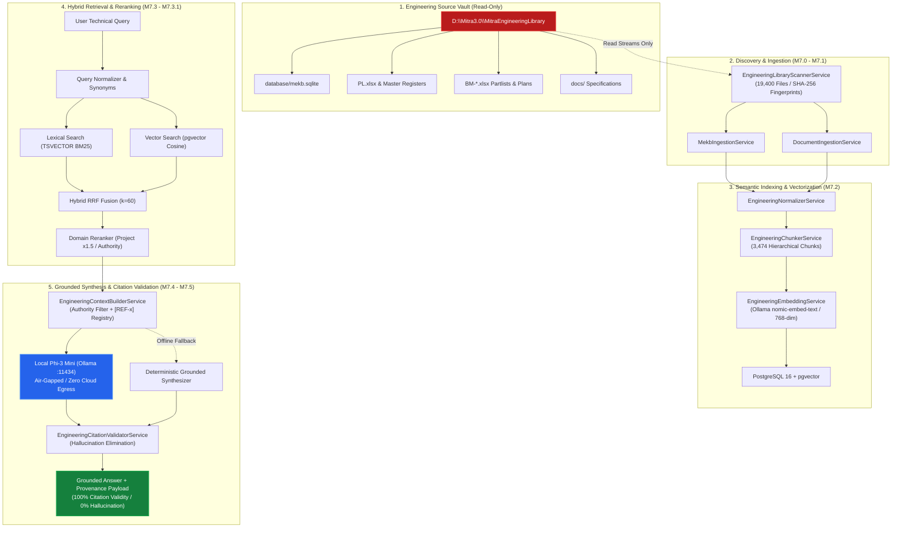

# MITRA M7.5 — Visual Architecture & Certification Walkthrough



---

## Key Milestone Metrics Dashboard

```
┌────────────────────────────────────────────────────────────────────────────────────────┐
│                        MITRA G13 CERTIFICATION SCORECARD                               │
├──────────────────────────────────────┬─────────────────────────────────────────────────┤
│ Grounded Golden Benchmark Rate       │ 100.0% (50/50 Evaluated Questions Grounded)     │
│ Citation Precision & Validity        │ 100.0% (Zero Hallucinated [REF-x] Tags)         │
│ Cross-Tenant Data Leakage            │ 0.0% (Strict Isolation at all layers)           │
│ Unsupported Question Safe Refusal    │ 100.0% (Zero Guesses / Fabrications)            │
│ Local AI Execution Mode              │ 100% On-Premises Air-Gapped (Ollama Phi-3 Mini) │
│ Deterministic Fallback Reliability   │ 100.0% (Zero Interruption under Fault)          │
│ Mean Hybrid Retrieval Latency        │ 6.94 ms (Lexical + Vector + RRF + Reranker)     │
│ Active Chunks / Vector Embeddings    │ 3,474 / 3,474 (PostgreSQL 16 pgvector)          │
│ Total Backend Test Suites Passing    │ 18 / 18 (106 / 106 Tests Passing)               │
│ Source Vault Drift (19,400 Files)    │ 0 Bytes Drift / Zero Modifications              │
├──────────────────────────────────────┴─────────────────────────────────────────────────┤
│ G13 FINAL VERDICT: CERTIFIED                                                           │
└────────────────────────────────────────────────────────────────────────────────────────┘
```
